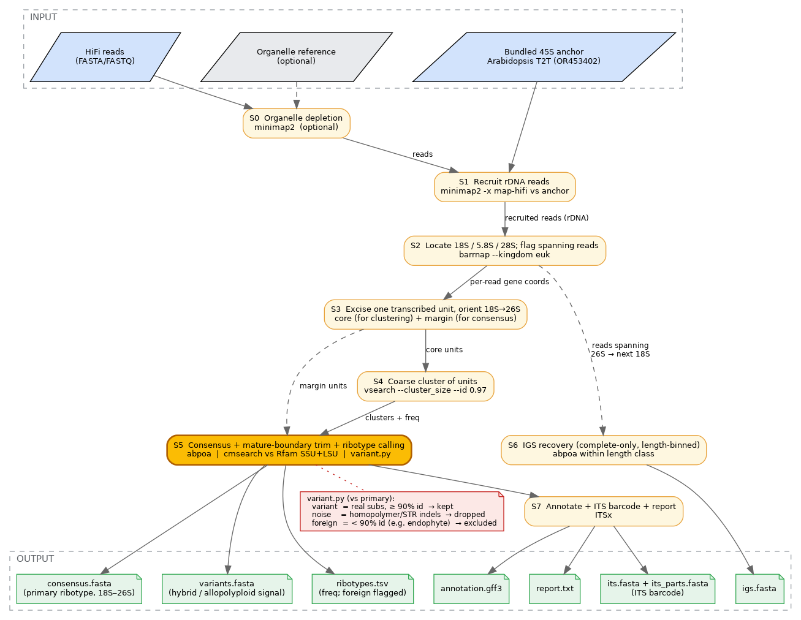

# easy45

**Assembly-free recovery of the 45S nrDNA transcribed unit and ribotype variants from HiFi long reads.**

easy45 recruits HiFi reads that span a full 45S nrDNA transcribed unit
(ETS–18S–ITS1–5.8S–ITS2–26S), then reconstructs that unit *without genome
assembly*. Because each HiFi read can span an entire repeat unit, easy45 treats
every spanning read as one independent molecule — letting it report not just a
consensus, but the genuine intragenomic ribotype diversity that assembly-based
consensus collapses.

## Outputs

1. **Consensus** — the primary ribotype of the transcribed unit.
2. **Variants** — additional ribotypes that pass homopolymer-aware, read-supported
   validation (a signal of hybridisation / allopolyploidy).
3. **IGS** *(best-effort)* — the intergenic spacer, reported per length class
   when reads span it cleanly.

## Pipeline



Recruit (minimap2) → locate genes (barrnap) → excise & orient units → cluster
(vsearch) → consensus + mature-boundary trim (abpoa + Rfam CMs) + homopolymer-aware
ribotype calling → IGS → annotate + ITS barcode (ITSx). See
[docs/pipeline.md](docs/pipeline.md) for the editable flowchart and details.

## Install

```bash
conda env create -f environment.yml
conda activate easy45
easy45 check-deps
```

All heavy tools (minimap2, seqkit, vsearch, ITSx, barrnap, abpoa, infernal) are
conda dependencies — the Python package itself stays pure-Python.

## Usage

```bash
easy45 run \
    -i reads.hifi.fastq.gz \
    -a anchor_18S_58S_26S.fasta \
    -r organelle.fasta \
    -o results/
```

## Citation

If you use easy45, please cite the manuscript (in preparation) and the archived
release on Zenodo (DOI to be added on first release).

## License

MIT. See [LICENSE](LICENSE).

## Status

Functional. All pipeline stages (S0–S7) are implemented and unit-tested, and the
recovered consensus has been validated as base-identical to independent
whole-genome assemblies. A manuscript describing easy45 is in preparation; a
versioned Zenodo release and bioconda package will accompany it.
