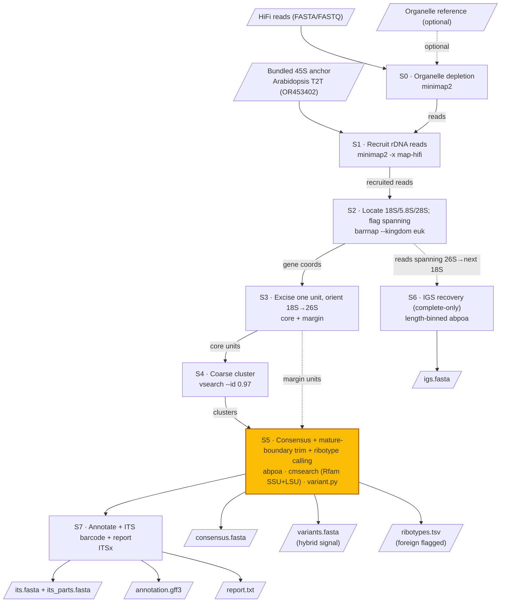

# easy45 pipeline

Rendered figure (also `pipeline.svg` for vector / publication use; source in
`pipeline.dot`, rebuild with `dot -Tpng docs/pipeline.dot -o docs/pipeline.png`):


## Flowchart (renders on GitHub)



## ASCII schematic

```
INPUT:  HiFi reads ──┐   (+ optional organelle ref)        bundled 45S anchor
                     ▼                                       (Arabidopsis T2T)
 S0  organelle depletion ............................. minimap2  [optional]
                     │ reads                                     │
                     ▼                                           ▼
 S1  recruit rDNA reads  ........................ minimap2 -x map-hifi vs anchor
                     │ recruited reads (rDNA, conserved 18S/26S)
                     ▼
 S2  locate 18S / 5.8S / 28S; flag spanning reads ... barrnap --kingdom euk
                     │ per-read gene coordinates                 └──► (reads spanning
                     ▼                                                 26S→next 18S)
 S3  excise ONE unit / read, orient 18S→26S                            │
       ├─ core units  (for clustering)                                 │
       └─ margin units (for consensus) ┐                               │
                     │ core            │ margin                        │
                     ▼                 │                               │
 S4  coarse cluster .. vsearch --id 0.97                               │
                     │ clusters + freq │                               │
                     ▼                 ▼                               ▼
 S5  CONSENSUS + mature-boundary trim + ribotype calling      S6  IGS recovery
       abpoa  →  cmsearch (Rfam SSU+LSU)  →  variant.py            (complete-only,
       classify vs primary:                                        length-binned)
         variant = real subs, ≥90% id     → kept                       │
         noise   = homopolymer/STR indels → dropped                    │
         foreign = <90% id (endophyte…)   → excluded                   │
                     │                                                 │
                     ▼                                                 ▼
 S7  annotate + ITS barcode + report ... ITSx                       igs.fasta
                     │
   ┌─────────────────┼──────────────────────────────────────────────┐
   ▼        ▼        ▼              ▼            ▼            ▼        ▼
consensus  variants  ribotypes   annotation   its.fasta +   report   (igs.fasta)
 .fasta    .fasta     .tsv        .gff3        its_parts     .txt
(primary) (hybrid)  (foreign                  (ITS barcode)
          signal)    flagged)
```

## Notes

- **One HiFi read spans one repeat unit** → each spanning read is an independent
  molecule; this is what lets S5 resolve ribotype *diversity*, not just a consensus.
- **S5 is the scientific core**: the consensus boundary is defined by Rfam
  covariance models (general, not tied to one reference), and ribotype variants
  are validated homopolymer-aware with an identity ceiling that rejects
  contaminant/endophyte rDNA as *foreign* rather than mis-calling a hybrid.
- **barrnap** only *detects* spanning reads (S2); the final mature 18S/26S termini
  come from **cmsearch** (S5).

---

# Detailed walkthrough (English)

**Concept.** The 45S nrDNA is a high-copy tandem array, and a single PacBio HiFi
read (~10–20 kb, Q≥30) can span an entire repeat unit. easy45 exploits this:
every read that fully spans the transcribed unit is treated as one independent
molecule of the array, so the tool can reconstruct the unit — and resolve its
intragenomic ribotype diversity — directly from reads, **without genome
assembly**.

**Inputs.** HiFi reads (FASTA/FASTQ, optionally gzipped); a bundled 45S anchor
(one intact repeat unit from the *Arabidopsis thaliana* T2T NOR2 assembly,
GenBank OR453402); and, optionally, a plastid+mitochondrial reference for
organelle depletion.

**S0 — Organelle depletion (optional).** Plastid DNA can dominate leaf
sequencing libraries. If an organelle reference is supplied, reads are mapped to
it with minimap2 and strong organelle hits are removed before recruitment. With
no reference the stage is a pass-through and emits a warning.

**S1 — Recruitment.** Reads are mapped against the bundled anchor with
`minimap2 -x map-hifi`; a read is recruited when its summed residue matches to
the anchor reach a threshold (default 300 bp). Recruitment is driven by the
highly conserved 18S/5.8S/26S genes, so it is naturally nuclear-specific —
bacterial-type plastid 16S/23S are too divergent to pass HiFi mapping
thresholds. In practice recruitment is very clean (≈99–100% of recruited reads
carry eukaryotic rRNA genes).

**S2 — Boundary detection.** `barrnap --kingdom euk` locates the 18S, 5.8S and
28S genes on each recruited read, with coordinates and strand. A read is flagged
as *spanning* the transcribed unit when it carries a complete 18S **and** a
complete 28S on the same strand — i.e. the whole ETS-free cistron is inside the
read. barrnap is fast and is used only to *detect* spanning reads; it does not
define the final termini (see S5).

**S3 — Cut and orient.** For each spanning read, an 18S is paired with its
downstream 28S whose combined span falls in the one-unit range (~4–9 kb), and
that single unit is excised — this correctly handles reads that contain more
than one unit. Units are strand-normalised (reverse-complemented when the rDNA
is on the read's minus strand) so all share one 18S→26S orientation. Two FASTAs
are written, keyed by read id: a **core** cut (barrnap boundaries; used for
clustering, so the variable ETS cannot fragment clusters) and a **margin**-
widened cut (±150 bp; used for the consensus, giving the covariance models room
to recover the true mature termini in S5).

**S4 — Coarse clustering.** `vsearch --cluster_size --id 0.97` groups the core
units into ribotype clusters with sizes and frequencies. This is intentionally a
coarse grouping that collapses near-identical units and separates clearly
divergent ones; the authoritative ribotype decision is made downstream.

**S5 — Consensus, mature-boundary trimming, and ribotype calling (the core).**
For each cluster passing the abundance gate (`--min-reads`, `--min-freq`) a POA
consensus is built with `abpoa` (at most 100 reads per cluster — HiFi accuracy
means ~100 reads already pin the consensus). Each consensus is then trimmed to
the precise mature 18S 5′ / 26S 3′ boundary by `cmsearch` against bundled Rfam
covariance models (SSU RF01960 + LSU RF02543) — a structure-aware, multi-taxon
definition that is independent of any single reference, unlike the gene-finder
boundaries of barrnap. The largest cluster becomes the **primary ribotype**
(`consensus.fasta`). Every other passing cluster is classified by `variant.py`
against the primary (aligned with `minimap2 --cs`):

- **variant** — highly similar (≥ 90% identity) yet differing at a minimum
  number of real substitution sites → a genuine ribotype (a hybrid /
  allopolyploid signal), written to `variants.fasta`;
- **noise** — differing only by mononucleotide (homopolymer / short-tandem-
  repeat) indels, the systematic HiFi error signature, which an abundance filter
  alone cannot remove → dropped;
- **foreign** — aligning at < 90% identity (e.g. a fungal endophyte recruited
  via the conserved 18S/26S, or a pseudogene) → excluded, never mis-called as a
  hybrid ribotype.

**S6 — IGS recovery (best-effort, complete-only).** From reads that cleanly span
from the 3′ end of one unit's 26S into the 5′ start of the next unit's 18S, the
intergenic spacer is excised and strand-normalised. Because IGS length is
polymorphic (tandem subrepeats), spacers are binned by length class and a POA
consensus is built only within each well-supported class — POA is never run
across length classes, which would fabricate gaps. Reads that do not fully span
the spacer are discarded; easy45 never emits a partial IGS.

**S7 — Annotation, ITS barcode, and report.** `ITSx` delimits
SSU/ITS1/5.8S/ITS2/LSU on the final ribotypes, written as `annotation.gff3`. The
ITS barcode is emitted both as a single contiguous ITS1-5.8S-ITS2 sequence
(`its.fasta`, the standard barcode for BLAST/GenBank) and as separate ITS1,
5.8S and ITS2 records (`its_parts.fasta`). A human-readable `report.txt`
summarises the ribotypes and raises warnings (organelle depletion skipped,
hybrid signal, foreign clusters excluded).

